# Crush architectural data-flow trace on real C4

**Branch / HEAD:** worktree `wg/agent-55/crush-trace`, parent commit `69ae688`
(`feat: crush-fixtures (agent-52)`), itself rooted at `90ba74f` (the same HEAD
audited in [`docs/crush-audit.md`](crush-audit.md) and reproduced in
[`docs/crush-fixtures-redproof.md`](crush-fixtures-redproof.md)).

This document traces what `impg crush` actually does on the canonical C4 input
from `docs/c4-crush-handoff.md`, using the failing tests in
`tests/test_crush_integration.rs` as oracles for the four architectural faults
identified by the audit (Failures 1–4). Every box on the flow diagram is
annotated with `file:line`. Each failure is mapped to the box (or boundary
between boxes) where the divergence originates, with a one-sentence hypothesis
about the architectural root cause.

The trace is observation-only. The only code change committed alongside it is a
pair of scoped `log::debug!` lines inside `apply_replacement_frontier` (see
[§5 Instrumentation added](#5-instrumentation-added)). No algorithm change.

## 1. Top-down flow diagram

```mermaid
flowchart TD
    %% --- CLI entry -----------------------------------------------------
    A0["CLI dispatch: Args::Crush<br/>src/main.rs:7704"]:::entry
    A1["Read GFA from disk, build ResolutionConfig<br/>src/main.rs:7745-7873"]:::entry
    A2["resolve_gfa_bubbles(gfa, config)<br/>src/resolution.rs:413"]:::entry

    %% --- Per-round loop ------------------------------------------------
    B0["resolve_graph_bubbles: round loop body<br/>for round in 0..max_iterations<br/>src/resolution.rs:454-632"]:::loop

    %% --- Stage 1: bubble identification --------------------------------
    C0["before_quality = graph_quality(graph)<br/>src/resolution.rs:456 (impl :994)"]:::quality
    C1["find_candidate_frontier(graph, config, seen)<br/>call site src/resolution.rs:458<br/>impl src/resolution.rs:1107"]:::discover
    C2["render_graph(graph) -> GFA bytes<br/>src/resolution.rs:1133 (impl :2912)"]:::discover
    C3["povu::NativeGfa::parse + decompose_flubbles<br/>src/resolution.rs:1142, 1152"]:::discover
    C4["per-site BubbleCandidate build (parallel)<br/>src/resolution.rs:1171-1249<br/>min_traversal_len gate :1220<br/>signature dedup vs `seen` :1233"]:::discover
    C5["sort + select frontier:<br/>candidate_selection_priority + estimated_step_savings<br/>src/resolution.rs:1253-1281<br/>candidate_within_selection_budget gate :1272"]:::discover
    C6["materialize_candidate_sequences (parallel)<br/>src/resolution.rs:1283-1290 (impl :1417)"]:::discover

    %% --- Stage 2: aligner selection per bubble -------------------------
    D0["log per-candidate traversal stats<br/>src/resolution.rs:520-534"]:::select
    D1["candidate_replacement_method (per candidate)<br/>src/resolution.rs:1559 (Auto -> :1569 -> :1577)<br/>delegates to candidate_selection_method :838"]:::select
    D2{"size-thresholding logic<br/>candidate_selection_method :838-855<br/>if max_len ≤ auto_spoa_max_traversal_len<br/>AND direct_replacement_within_budget :857-866<br/>then Poa else Allwave"}:::select

    %% --- Stage 3: aligner invocation -----------------------------------
    E0["par_iter().map(build...) over selected<br/>src/resolution.rs:515-563<br/>(rayon parallel, one task per bubble)"]:::build
    E1["build_replacement_with_method(candidate, method)<br/>src/resolution.rs:1544"]:::build
    E2a["build_poa_replacement<br/>src/resolution.rs:1968 (SPOA)"]:::build
    E2b["build_poasta_replacement<br/>src/resolution.rs:1997"]:::build
    E2c["build_biwfa_inmemory_replacement<br/>src/resolution.rs:2101"]:::build
    E2d["build_allwave_seqwish_replacement<br/>src/resolution.rs:1797"]:::build
    E2e["build_sweepga_seqwish_replacement<br/>src/resolution.rs:1891<br/>(all-vs-all FastGA, no sparsify)"]:::build

    %% --- Stage 3b: shared pairwise tail --------------------------------
    F0["seqwish induce: syng_graph::build_gfa_from_paf_and_sequences<br/>src/resolution.rs:1887 (allwave) / :1964 (sweepga)"]:::build
    F1["finalize_pairwise_induced_replacement<br/>src/resolution.rs:1733"]:::build
    F2["unchop_gfa (gfaffix) -> parse -> order_replacement_paths<br/>src/resolution.rs:1759-1764"]:::build
    F3["polish_replacement_gfa (per-replacement)<br/>src/resolution.rs:1767 (impl :2313)<br/>Smooth -> :2363; PoA/Poasta -> :2329"]:::polish
    F4["validate_replacement_paths (per-replacement)<br/>src/resolution.rs:1772, 1793"]:::build

    %% --- Stage 4: round-level acceptance / rewrite ----------------------
    G0["collect Vec<ReplacementPlan>; bailed counted<br/>src/resolution.rs:567-585"]:::accept
    G1["apply_replacement_frontier(graph, plans)<br/>call site src/resolution.rs:613<br/>impl src/resolution.rs:1452"]:::accept
    G2["build replacements_by_path map<br/>src/resolution.rs:1453-1478"]:::accept
    G3["per-path step rewrite (replace begin_step..end_step with replacement.steps)<br/>src/resolution.rs:1480-1528"]:::accept

    %% --- Stage 5: graph emission ---------------------------------------
    H0["render_rewritten_graph(graph, replacement_graphs, used_original, out_paths)<br/>src/resolution.rs:1534 (impl :2810)"]:::emit
    H1["walk ordered_nodes; emit S-lines<br/>Original keeps original id :2839<br/>Replacement gets next_unused_segment_id :2851<br/>NO seq->id dedup"]:::emit
    H2["emit L-lines + P-lines from out_paths<br/>src/resolution.rs:2862-2897"]:::emit
    H3["parse_gfa(rendered)<br/>src/resolution.rs:1535"]:::emit
    H4["path_sequences_equal(before, after) check<br/>src/resolution.rs:1536 (impl :2796)<br/>(the ONLY surviving acceptance criterion)"]:::accept
    H5["graph = next_graph (unconditional accept)<br/>src/resolution.rs:616"]:::accept
    H6["after_quality = graph_quality(next_graph) (logged only)<br/>src/resolution.rs:615"]:::quality

    %% --- Output --------------------------------------------------------
    I0["render_graph(graph) on loop exit<br/>src/resolution.rs:636 (impl :2912)"]:::out
    I1["Write resolved.gfa to --output<br/>src/main.rs:7884-7893"]:::out

    %% --- Edges ---------------------------------------------------------
    A0 --> A1 --> A2 --> B0
    B0 --> C0 --> C1
    C1 --> C2 --> C3 --> C4 --> C5 --> C6
    C6 --> D0 --> E0
    E0 --> D1 --> D2
    D2 -->|StarBiwfa| E2c
    D2 -->|Poa| E2a
    D2 -->|Poasta| E2b
    D2 -->|Allwave| E2d
    D2 -->|Sweepga| E2e
    E1 -.dispatch.-> E2a & E2b & E2c & E2d & E2e
    E2d --> F0
    E2e --> F0
    F0 --> F1 --> F2 --> F3 --> F4
    F4 --> G0
    E2a --> G0
    E2b --> G0
    E2c --> G0
    G0 --> G1 --> G2 --> G3 --> H0
    H0 --> H1 --> H2 --> H3 --> H4 --> H6 --> H5
    H5 -.next round.-> B0
    B0 -.loop exit when frontier empty or max_iterations.-> I0
    I0 --> I1

    classDef entry  fill:#e7f0ff,stroke:#3c64ff,color:#102050;
    classDef loop   fill:#fff3d6,stroke:#c08800,color:#332200;
    classDef quality fill:#eef0f3,stroke:#7a8597,color:#222;
    classDef discover fill:#e3fbe3,stroke:#2e8b2e,color:#0a2a0a;
    classDef select fill:#fef3ff,stroke:#9c2cc8,color:#3a0040;
    classDef build  fill:#dff7fb,stroke:#1d8aa6,color:#04303a;
    classDef polish fill:#f5e6cc,stroke:#a06600,color:#3a2400;
    classDef accept fill:#ffd9d9,stroke:#c01414,color:#400a0a;
    classDef emit   fill:#ffe0c2,stroke:#d56500,color:#3d1c00;
    classDef out    fill:#e0e0e0,stroke:#555,color:#111;
```



State that crosses each boundary, in flight order:

| boundary | state in flight | type | size on C4 round 1 |
|---|---|---|---|
| `A2 -> B0` | mutable `Graph`, immutable `ResolutionConfig` | rust struct | 18 048 segments / 389 354 bp |
| `C0 -> C1` | `Graph`, `seen: FxHashSet<String>` | rust struct + set | 0 signatures on round 1 |
| `C1 -> C2 -> C3` | rendered GFA `String`, then `povu::NativeGfa` | bytes | ~6 MB (round 1) |
| `C3 -> C4` | `Vec<povu::Site>` reference-grounded on root path | rust struct | 2 441 sites (round 1 obs.) |
| `C4 -> C5 -> C6` | `Vec<BubbleCandidate>` (signature, ranges, traversal_stats, root_span) | rust struct | 72 unseen polymorphic candidates -> 8 selected |
| `D0 -> E0 -> E1 -> D2 -> E2x` | `BubbleCandidate` + chosen `ResolutionMethod` | enum + struct | per-bubble |
| `E2x -> F0 -> F1 -> F2 -> F3 -> F4` | rendered seqwish/POA GFA, then parsed `Graph`, then polished `Graph` | bytes -> struct | varies per bubble |
| `F4 -> G0` | `Option<ReplacementPlan>` (candidate + replacement Graph) | rust struct | 8 plans accepted on round 1 |
| `G0 -> G1 -> G2` | `&Graph`, `&[ReplacementPlan]` -> `FxHashMap<usize, Vec<PathReplacement>>` | map keyed by path_idx | 8 plans expanded across many paths |
| `G2 -> G3 -> H0` | `Vec<(name, Vec<OutStep>)>` where `OutStep::node: OutNode` is either `Original(orig_idx)` or `Replacement(plan_idx, node_idx)` | rust enum-tagged step list | 4 591 855 steps round 1 input |
| `H0 -> H1` | `(graph, replacement_graphs, used_original, out_paths)` | borrowed slices | 8 replacement graphs |
| `H1 -> H2 -> H3` | new GFA `String`; segments use **fresh integer ids per replacement node**, no sequence dedup across plans | bytes | ~6 MB (round 1) |
| `H3 -> H4` | parsed `Graph next`, `path_sequence_map(before) == path_sequence_map(after)` | bool | true (round 1) |
| `H4 -> H5` | `graph = next` (unconditional) | rust struct | 20 919 segments / 696 283 bp (round 1) |
| `H6 -> H5` | `after_quality` computed and logged but **not consulted** | struct | logged only |
| `B0 (next iter) -> C0` | the now-bigger `graph` re-enters POVU discovery | rust struct | round 2 sees 18.4 MB single-candidate traversal |
| `B0 -> I0 -> I1` | final `render_graph(graph)` to disk | bytes | (never reached within budget on Failure 1) |

## 2. Stage table (audit-aligned, line-precise)

| stage | code (`file:line`) | notes |
|---|---|---|
| CLI entry, GFA read, config build | `src/main.rs:7704-7873` | `Args::Crush` arm; calls `resolve_gfa_bubbles(&gfa_text, &config)` at `src/main.rs:7875` |
| top-level entry | `resolve_gfa_bubbles` `src/resolution.rs:413` | thin wrapper; parses GFA, calls `resolve_graph_bubbles` :426 |
| round loop | `resolve_graph_bubbles` `src/resolution.rs:454-632` | one iteration = discover -> build -> rewrite |
| **bubble identification (POVU)** | `find_candidate_frontier` `src/resolution.rs:1107` (called at :458); renders graph :1133, POVU parse :1142, POVU decompose :1152, candidate build :1171-1249, sort+select :1253-1281, materialize :1283-1290 | uses path 0 as reference; `min_traversal_len` gate :1220 |
| **aligner selection by bubble size** | `candidate_selection_method` `src/resolution.rs:838-855` (per-candidate dispatch at `candidate_replacement_method` :1559 / `auto_replacement_method` :1569); per-candidate logging :520-534 | the `Auto` -> SPOA-vs-AllWave threshold: `max_len ≤ auto_spoa_max_traversal_len && direct_replacement_within_budget` -> Poa, else Allwave |
| **aligner invocation** | `build_replacement_with_method` `src/resolution.rs:1544`; one task per bubble dispatched by `par_iter().map(...)` at :515-563; backends at `build_poa_replacement` :1968, `build_poasta_replacement` :1997, `build_biwfa_inmemory_replacement` :2101, `build_allwave_seqwish_replacement` :1797, `build_sweepga_seqwish_replacement` :1891 | parallel across bubbles; per-bubble synchronous; output is a fresh per-replacement `Graph` |
| pairwise tail (allwave/sweepga only) | `seqwish_replacement_config` :1604, `syng_graph::build_gfa_from_paf_and_sequences` call sites :1887 / :1964, `finalize_pairwise_induced_replacement` :1733 -> `unchop_gfa` :1759 -> `polish_replacement_gfa` :1767 -> `validate_replacement_paths` :1793 | the bounded-smooth polish at :2363 dominates wall time on big bubbles (Failure 1 round 3) |
| **replacement integration into working graph** | round loop merge block `src/resolution.rs:611-617`; `apply_replacement_frontier` :1452 builds `replacements_by_path` map :1453-1478, **per-path step rewrite** :1480-1528, calls render/parse/validate :1534-1540, returns `next` graph; round loop assigns `graph = next_graph` at :616 with **no quality gate** | only surviving acceptance criterion is `path_sequences_equal` (per-path byte equality) at :1536 / :2796 |
| **path rewriting through replaced bubbles** | `apply_replacement_frontier` per-path rewrite :1480-1528; produces `Vec<OutStep>` whose `OutNode` is either `Original(idx)` or `Replacement(plan_idx, node_idx)` :1463-1467, :1519-1524 | the OutNode tagging is what later causes Failure 3: every `Replacement(plan, node)` becomes a distinct emitted segment id even if the sequence collides with another |
| **graph emission/serialization** | `render_rewritten_graph` `src/resolution.rs:2810`; ordered-node walk :2826-2836 (path-step order); S-line emit :2836-2860 — original nodes keep their id (:2839), replacement nodes get `next_unused_segment_id` (:2851) **without seq->id dedup**; L-lines :2862-2882; P-lines :2884-2897 | final on-disk render is the same `render_graph` :2912 called at :636 |

## 3. Failure-to-box mapping

Each failure below references the audit at `docs/crush-audit.md` and the red
regression test at `tests/test_crush_integration.rs`. The "boxes involved" list
uses the diagram labels above (A0…I1). The "suspected architectural fault"
column names the single boundary at which the divergence first becomes
irreversible. The hypothesis is one sentence; rationale follows.

| failure | red test (`#[ignore]`) | observed on HEAD | boxes involved | suspected architectural fault | one-sentence hypothesis |
|---|---|---|---|---|---|
| **Failure 2** — no round-level quality gate | `c4_round1_sweep_quality_gate_rejects_score_growth` `tests/test_crush_integration.rs:148` | segment-bp grew 18.7% on round 1 (389 316 -> 461 998); audit reports 78.8% with full polish | **H5** (`graph = next_graph` :616), **H6** (`after_quality` is computed but never compared), **G0** | **The `H6 -> H5` boundary at `src/resolution.rs:611-617`** | `apply_replacement_frontier` returns a graph that satisfies only the per-path byte-equality invariant; the deleted round-level rollback used to gate this boundary and was removed in `0af1a4c`, leaving an unconditional `graph = next_graph` with `before_quality`/`after_quality` computed for logging only. |
| **Failure 3** — duplicate segment sequences across replacements | `c4_round1_render_emits_no_duplicate_segment_sequences` `tests/test_crush_integration.rs:235` | 5 474 segments share a sequence with another segment after round 1; even the small slice round (`auto`, max-iter=1) shows 948 dup-sequence segments out of 2 984 (verified via new debug log) | **G3** (per-path rewrite emits `OutNode::Replacement(plan_idx, node_idx)`), **H0**, **H1** (`next_unused_segment_id` :2851) | **The `G3 -> H1` boundary** — i.e., the way `OutNode::Replacement(plan_idx, node_idx)` is mapped to S-lines | `render_rewritten_graph` walks `ordered_nodes` and assigns a fresh integer id to *every* `OutNode::Replacement(plan_idx, node_idx)` (`src/resolution.rs:2851`) with no `seq -> id` deduplication, so two independent replacements that emit byte-identical sequences (typical for C4 tandem-paralog bubbles) become two separate S-lines. |
| **Failure 4** — round-over-round candidate inflation | `c4_round2_segment_bp_does_not_exceed_round1` `tests/test_crush_integration.rs:310` | 33.6% bp growth after 2 rounds; audit shows the dominant round-2 candidate jumps to 18.4 MB of traversal sequence | **H5** (round 1 unconditional accept), **B0** (next-iter entry on bloated graph), **C1**/**C5** (POVU on bloated graph re-selects wider bubbles), **D2** -> **E2e** | **The `H5 -> B0` loop-edge boundary** | Because `H5` accepts any byte-equality-preserving rewrite, the working graph entering the next round's POVU pass has wider bubble boundaries (Failure 3 collapses unique anchors that previously fenced bubbles); without a monotone-progress condition on `H5`, the loop has no fixed point and candidate budgets compound. |
| **Failure 1** — canonical command does not finish within budget | `c4_canonical_command_completes_within_budget` `tests/test_crush_integration.rs:387` | exit code 124 (timeout 360 s); known-good baseline finished in 279 s | **H5** (root cause: cascade from Failures 2-4), **E2e** + **F3** (sweepga + smooth dominate wall time on inflated round-N candidate), **B0** (no per-round wall budget) | **The same `H5 -> B0` loop-edge boundary, but the proximate cost lands in `E2e` + `F3`** | Round 3's largest candidate is 18.7 MB of traversal sequence over 440 paths; `build_sweepga_seqwish_replacement` (:1891) followed by `polish_replacement_gfa_with_smooth` (:2363) is O(N · L²) at that scale, so the SIGTERM lands inside the polish step — but the root cause is upstream: there is no acceptance gate on `H5` and no per-round wall budget on `B0`, so the loop *should* have stopped at round 1. |

## 4. Composition issues — places where each piece looks reasonable in isolation but combined produces the wrong result

These are not bugs in any single function. Each is a wrong invariant assumed at
a handoff between functions that are individually correct.

1. **`path_sequences_equal` is sufficient for the per-replacement validator, but the round loop also uses it as the only acceptance criterion.**
   `validate_replacement_paths` (`src/resolution.rs:2436`) and
   `path_sequences_equal` (`:2796`) correctly enforce that every input path
   still spells its original sequence after the per-replacement build, and
   correctly enforce the same invariant on the post-rewrite working graph
   (called from `apply_replacement_frontier` :1536). Each call is correct on
   its own. The composition failure is at `src/resolution.rs:611-617`: the
   round loop reuses *only* this invariant for round-level acceptance, having
   removed the complexity/quality gate in `0af1a4c`. A two-callsite invariant
   ("the alignment didn't corrupt any path") is silently repurposed as a
   four-failure invariant ("this round of the loop is acceptable"). Failure 2
   is the direct consequence.

2. **`OutNode` is a precise identifier inside `apply_replacement_frontier`, but `render_rewritten_graph` treats `OutNode::Replacement(plan_idx, node_idx)` as the canonical segment identity for the emitted GFA.**
   `OutNode::Replacement(plan_idx, node_idx)` is the right key while we are
   rewriting paths through *one specific* replacement graph in
   `apply_replacement_frontier` :1463-1467 (you must keep replacements from
   different plans separate so the per-path step rewrite addresses the right
   replacement). But `render_rewritten_graph` :2826-2860 uses that same
   identity as the segment identity for the *output graph*. Two replacements
   that emit byte-identical sequences are still distinct `OutNode`s, get two
   different `next_unused_segment_id` values, and are emitted as two S-lines.
   The function is logically correct given its inputs; the wrong invariant is
   the upstream choice to carry `(plan_idx, node_idx)` all the way to the
   serializer without ever projecting it through `seq -> id`. Failure 3 is
   the direct consequence.

3. **The bubble identifier (POVU) is order-dependent on the working graph it sees, but the round loop hands it a working graph mutated by the previous round's acceptance.**
   `find_candidate_frontier` :1107 is correctly deterministic in its input
   graph: same graph in -> same flubble decomposition out. The round loop at
   :454-632 invokes it on the *current* working graph, which is the
   post-rewrite graph from the previous round. After round 1 accepts wider
   replacements that collapse short anchors (Failure 3), the next POVU pass
   sees fewer anchor fence-posts and therefore picks up bubbles with a much
   wider `root_span` and much larger median traversal length (round-1 medians
   ~157 bp -> round-2 medians ~42 430 bp on the same site cluster). POVU is
   correct; the round loop is correct; the composition assumes a
   monotone-progress invariant on the working graph that no code in the loop
   enforces. Failure 4 is the direct consequence.

4. **Per-replacement work is fanned out via `par_iter` and "looks bounded" because each task's `validate_replacement_paths` succeeds, but there is no round-level wall-clock budget.**
   `par_iter().map(...)` at :515-563 dispatches one synchronous build per
   selected bubble. Each build hits `validate_replacement_paths` :1793 and
   either succeeds, returns empty, or errors. None of the per-replacement
   paths consult a deadline. The round loop at :454-632 also has no
   `Instant`-based deadline. The composition is "trust the per-replacement
   build to finish in bounded time", but the bounded-smooth polish at :2363
   is unbounded with respect to traversal count and length, and the inflated
   round-3 candidate (18.7 MB / 440 paths) does not finish within the 30 min
   wall budget. Failure 1 is the proximate consequence (the SIGTERM lands
   inside the polish), but the architectural fault is that no box in the
   diagram is a deadline owner.

## 5. Instrumentation added

The only code change in this trace commit is two `log::debug!` lines inside
`apply_replacement_frontier` (`src/resolution.rs:1452`), gated by
`log::log_enabled!(log::Level::Debug)`:

- Before the render: `crush apply: N plan(s); replacement segments total=X, replacement bp total=Y; rewriting Z path(s)` — quantifies the input to the integration boundary.
- After parse: `crush apply: rendered B bytes -> parsed graph has S segment(s), P path(s), U unique segment sequence(s), D duplicate-sequence segment(s)` — quantifies Failure 3 directly (the `D` count is the round-1 dup-sequence count visible to the eye on real C4).

These two lines fire under `-v 2` (debug) or `RUST_LOG=debug`. They make the
two architectural failures (Failure 2's "what did this round actually add" and
Failure 3's "how many of those segments are duplicate sequences") visible at
the architectural boundary where they originate, without changing any
algorithm.

Verified on the committed slice (`tests/test_data/crush/c4_slice_1500_3000.gfa`,
`--method auto --max-iterations 1`, 2026-05-24, this worktree):

```
crush apply: 147 plan(s); replacement segments total=1205, replacement bp total=19722; rewriting 465 path(s)
crush apply: rendered 5388459 bytes -> parsed graph has 2984 segment(s), 465 path(s), 2036 unique segment sequence(s), 948 duplicate-sequence segment(s)
```

948 duplicate-sequence segments on the slice (out of 2 984 total) is the same
class of pathology that crush-fixtures Test 2 reports as 5 474 on the full C4
input — Failure 3 is visible at the slice scale too; only the absolute counts
differ.

The pre-existing per-round summary at `src/resolution.rs:620-631`
(`"crush round N: resolved M/K replacement(s) ... quality {} -> {}"`) already
covers the visibility needed for Failures 1, 2, and 4 (per-round wall, plus
before/after `GraphQuality`); no additional logging was needed at those
boundaries.

## 6. What is explicitly *not* a failure

Same as the audit (`docs/crush-audit.md` §"Notes on what was not a failure"):

- Aligner correctness (SPOA / Poasta / Allwave / Sweepga): outputs pass
  `validate_replacement_paths` (:2436) per-replacement byte-equality.
- POVU flubble detection: deterministic on its input graph; site counts are
  internally consistent at each round (2 441 -> 2 340 -> 2 648). The bubble
  shape changes round-over-round because the working graph changes (Failure 4),
  not because POVU is wrong.
- Path-sequence preservation across rounds: every accepted round preserves
  every input path sequence exactly (:1536 enforces this on every round).
  Paths are not corrupted; the graph just grows.
